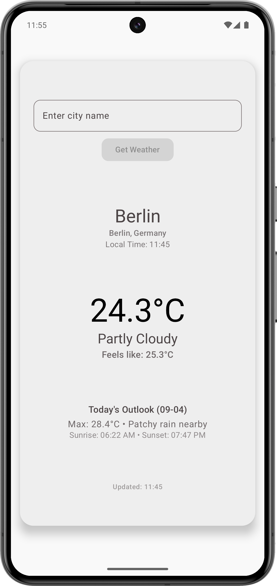
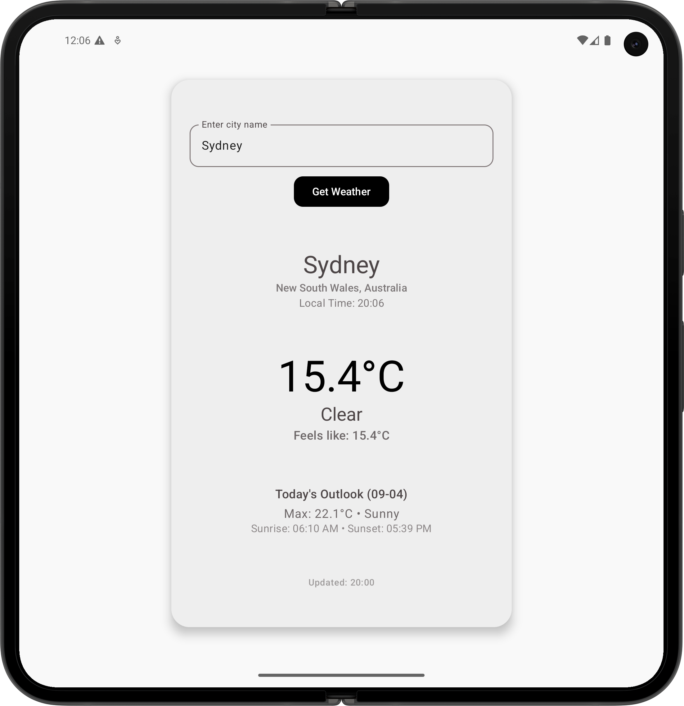
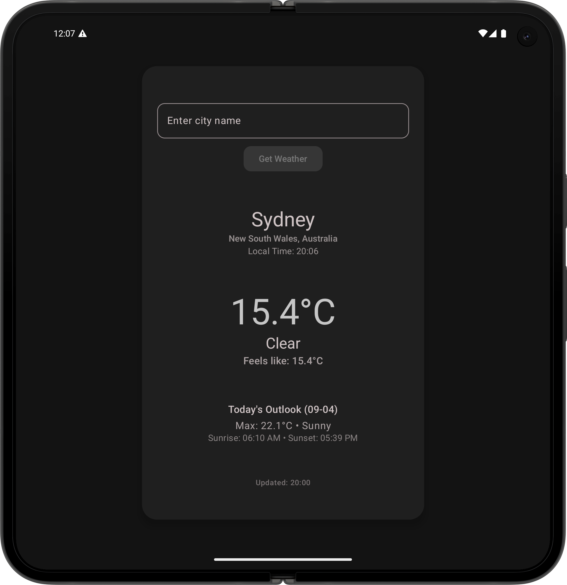

# Weather App

A simple Android weather application that provides current weather information and forecasts for any city worldwide.

## Features

- Search weather by city name
- Current temperature and weather conditions
- Today's forecast with sunrise/sunset times
- Offline caching - loads last searched location on startup
- Material 3 design with light/dark theme support
- Loading states and error handling

## Screenshots

<table>
  <tr>
    <td align="center">
      
      <br/>Light Theme
    </td>
    <td align="center">
      
      <br/>Pixel 9 Pro Fold
    </td>
    <td align="center">
      
      <br/>Dark Theme
    </td>
  </tr>
</table>

## Demo Videos

- 
- 

## Technical Stack

- **Jetpack Compose** - Modern declarative UI toolkit
- **MVVM Architecture** - Clean separation of concerns
- **StateFlow** - Reactive state management
- **Room Database** - Local data persistence
- **Koin** - Dependency injection
- **OkHttp** - HTTP client for API calls
- **kotlinx.serialization** - JSON parsing
- **Material 3** - Modern design system

## API

Weather data is provided by [WeatherAPI.com](https://weatherapi.com). You'll need to obtain a free API key and add it to your `local.properties` file:

```
weatherKey=your_api_key_here
```

## Building

1. Clone the repository
2. Add your WeatherAPI key to `local.properties`
3. Open in Android Studio
4. Build and run

**Minimum SDK:** 31 (Android 12)  
**Target SDK:** 36

## Project Structure

```
app/src/main/java/abbas17kh/weatherapp/
├── data/                   # Data layer
│   ├── json/               # API response models
│   ├── Database.kt         # Room database
│   └── WeatherDao.kt       # Database access
├── di/                     # Dependency injection
├── ui/
│   ├── screen/            # Compose screens and ViewModels
│   └── theme/             # App theming
└── MainActivity.kt
```